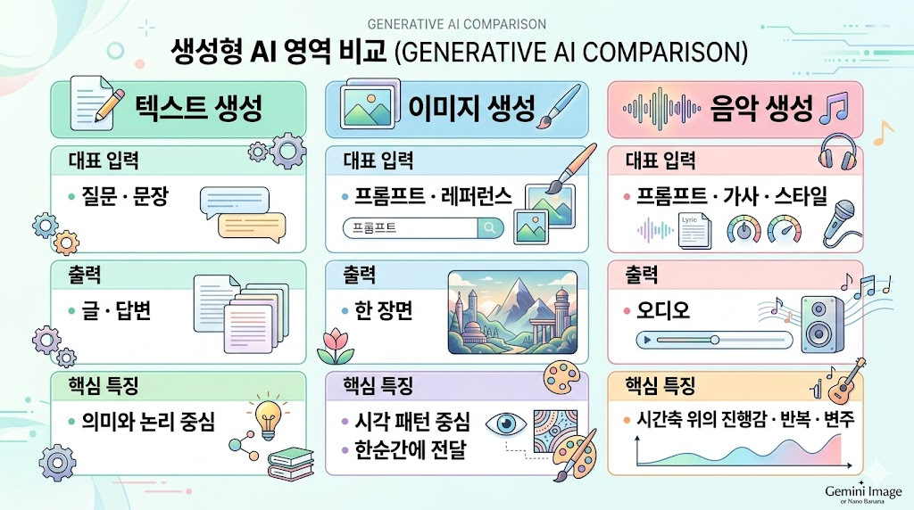
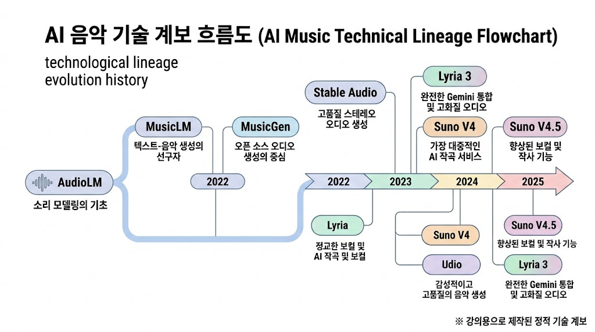
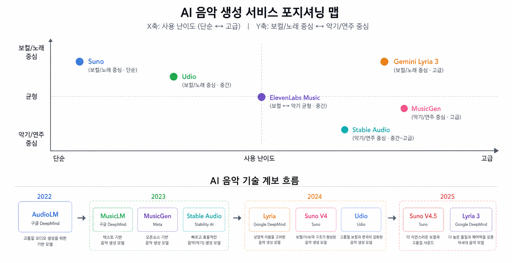
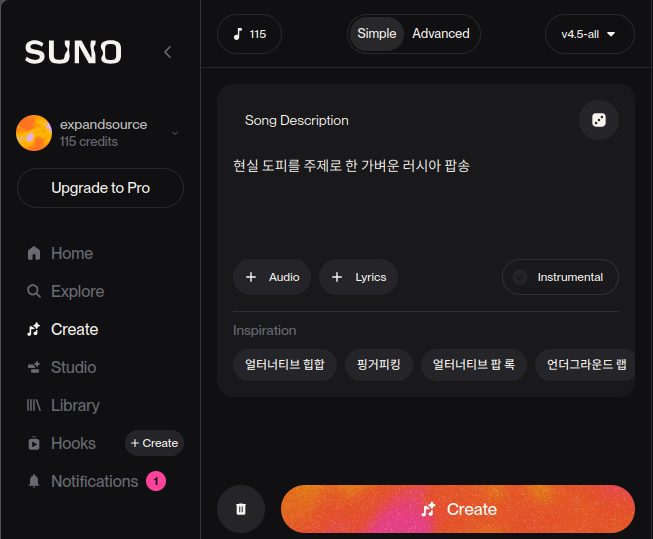
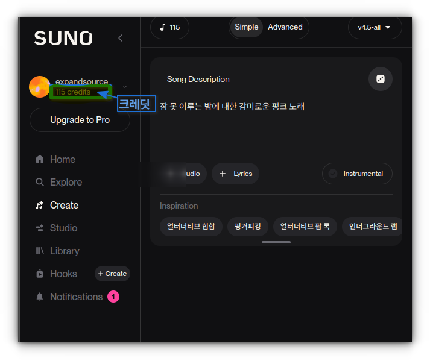
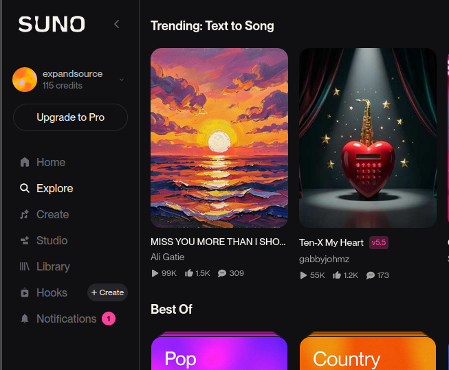
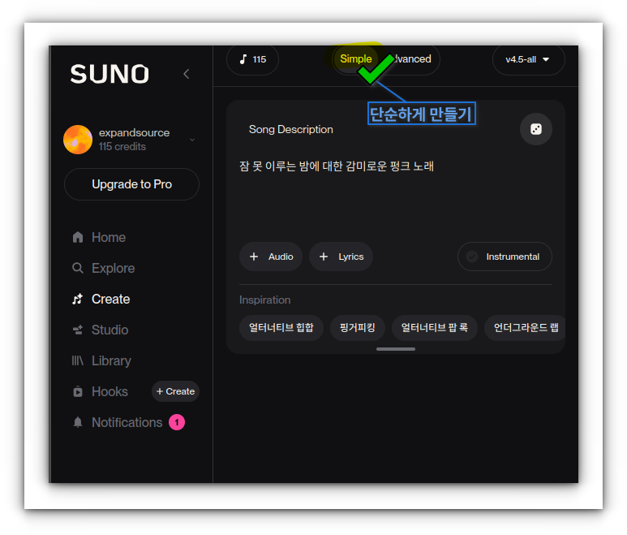
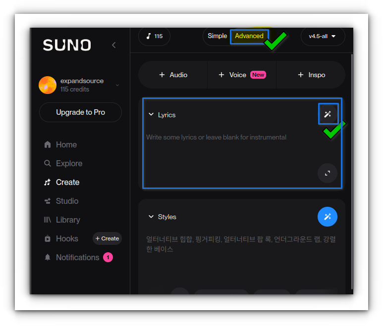
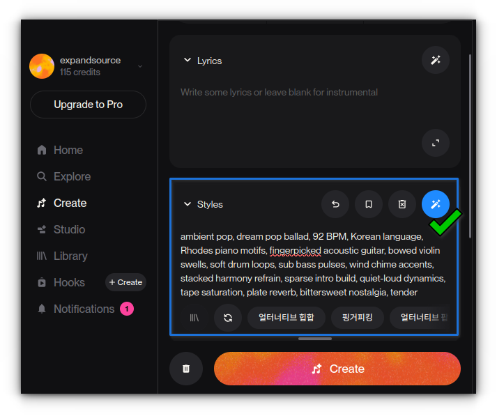
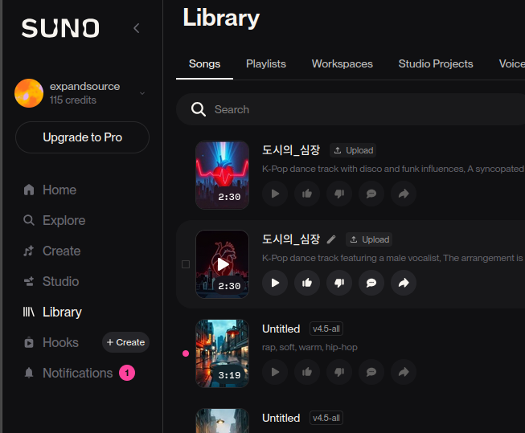

# AI를 활용한 나만의 음악 및 음원 작곡하기

> 이번 시간의 주인공은 **소리**다. 더 정확히는 **시간 위에서 전개되는 소리**, 즉 음악이다.

음악은 다른 매체와 다르다. 텍스트는 선형적이고, 이미지는 한순간에 전해지지만, 음악은 **시간이 필요하다**. 30초가 지나야 분위기를 알 수 있고, 3분이 지나야 한 곡이 완성된다. 그 3분을 AI가 대신 작곡·편곡·연주·녹음까지 해준다는 것 — 그것이 오늘 우리가 마주할 도약이다.

우리가 오늘 다룰 것은 두 도구다. **Google Gemini의 Lyria 3**는 평소에 쓰는 Gemini 안에서 "짧은 체험"을 하기에 좋다. **Suno AI**는 무료 계정으로도 한 곡을 끝까지 만들어볼 수 있는, 이번 시간의 **본 실습 도구**다.

오늘이 끝날 때쯤, 여러분은 각자 **자기 이름으로 태어난 한 곡**을 가지게 될 것이다. 그 곡이 세상을 바꾸지는 않겠지만, "나는 악기를 못 다루고 작곡도 배운 적 없는데 내 노래가 있다"는 경험은 앞으로의 창작·업무·가족 이벤트에서 예상 못한 곳에 쓰인다.


> 생성 가이드 — 파형(waveform), 악보, Suno/Gemini 로고(또는 색상만), 마이크 아이콘, 헤드폰 등을 콜라주한 16:9 커버. 톤은 파랑-보라 계열. Midjourney `--ar 16:9` 또는 Nano Banana로 가능.

---

## 1부. AI 음악 생성 이해하기

### 1.1 텍스트·이미지·음악 생성의 차이

**텍스트 생성**은 "다음 단어를 확률적으로 예측"하는 일이고, **이미지 생성**은 "노이즈에서 한 장면을 복원"하거나 "다음 이미지 토큰을 예측"하는 일이다. 그러면 **음악 생성**은 무엇을 하는 일일까?

음악은 앞의 둘과 근본적으로 다른 특성이 하나 있다. **시간이 펼쳐진다는 것**이다.

| 영역 | 대표 입력 | 출력 | 핵심 특징 |
|---|---|---|---|
| **텍스트 생성** | 질문·문장 | 글·답변 | 의미와 논리 중심 |
| **이미지 생성** | 프롬프트·레퍼런스 | 한 장면 | 시각 패턴 중심, 한순간에 전달 |
| **음악 생성** | 프롬프트·가사·스타일 | 오디오 | **시간축 위의 진행감·반복·변주** |

그림 한 장은 "좋다/나쁘다"를 1초 안에 느낀다. 하지만 음악은 **1분 30초짜리 후렴이 나올 때까지** 기다려야 완전한 판단이 가능하다. 그래서 AI가 음악을 만들 때는 "예쁜 한 장"이 아니라 **진행되고 반복되고 변주되는 구조**를 생성해야 한다. 인트로가 있고, 벌스가 있고, 후렴이 커지고, 브리지가 변화를 주고, 아웃트로로 끝난다. 이 구조를 지키지 못하면 "AI 같다"는 느낌이 강해진다.



> 생성 가이드 — 세 영역을 가로로 배치한 인포그래픽. 각 열에 대표 아이콘(문서·그림·파형) + 입력·출력·핵심 특징 세 줄. 파스텔 톤. Gemini Image 또는 Nano Banana로 "three columns comparison infographic, text-image-music generation" 등.

---

### 1.2 소리가 데이터가 된다는 것 — 음악의 디지털화

AI가 음악을 만든다는 건 결국 **소리를 숫자로 다룬다**는 뜻이다. 그 출발점은 **소리의 디지털화**.

#### 소리는 공기의 떨림이다

손뼉을 치면 공기가 진동한다. 그 진동이 우리 귀의 고막을 흔들어 "소리"로 인식된다. 이 진동을 그래프로 그리면 위아래로 출렁이는 **파형(waveform)** 이 된다. 음악은 결국 이 파형의 연속이다.

#### 디지털화 = "1초에 몇 번이나 측정하나"

LP·카세트 시대에는 소리를 그대로 자기·홈에 새겼다. CD·mp3·스트리밍 시대에는 소리를 **숫자로 측정해 저장**한다. 어떻게?

- **샘플링(sampling)**: 1초 동안 파형의 높낮이를 **수만 번 측정**. CD 음질은 초당 **44,100번** (44.1kHz). 즉 1초의 소리가 4만 4천 개의 숫자로 변환된다.
- **양자화(quantization)**: 각 측정값을 **얼마나 세밀하게** 기록할지. CD는 16비트 = 65,536단계.

3분짜리 한 곡이면 약 **1,500만 개의 숫자**다. 이 숫자들의 나열이 바로 음악 파일 안에 들어 있는 내용이다.

#### 그래서 AI가 다룰 수 있다

숫자라면 컴퓨터가 **계산**할 수 있다. 늘이고, 줄이고, 더하고, 패턴을 찾고, 새로 만들어낼 수 있다. AI 음악 생성은 결국 "이런 숫자 수백만 개 다음에 자연스럽게 이어질 숫자는 무엇일까?"를 예측하는 일이다.

> 음악 한 곡이 1,500만 개 숫자라면, AI가 한 번에 모든 숫자를 만들지는 않는다. 보통은 더 큰 단위(짧은 소리 조각, "토큰")로 묶어 다룬다. 이 부분은 뒤에서 더 본다.

---

### 1.3 STT와 TTS — AI는 이미 소리를 다뤄왔다

음악 생성은 갑자기 등장한 기술이 아니다. AI가 소리를 다루는 영역은 이미 오래전부터 우리 일상에 들어와 있다.

#### STT (Speech-to-Text) — "음성을 글자로"

말을 글자로 받아 적는 기술. 우리는 이미 매일 쓰고 있다.

- **유튜브 자동 자막** — 영상의 음성을 글자로 변환
- **Siri · Bixby · "OK Google"** — 음성 명령 인식
- **카카오톡 음성 메시지 → 텍스트** — 발화를 받아 적기
- **OpenAI Whisper** — 정확도 높은 오픈소스 STT. 2022년 공개 후 표준이 됨
- **회의록 자동 작성** (Otter, Notta, Naver Clova Note)

핵심 아이디어: 소리 파형 → "ㅏ", "ㅇ", "k"처럼 음성의 **최소 단위(음운)** 인식 → 단어·문장으로 조합.

#### TTS (Text-to-Speech) — "글자를 음성으로"

거꾸로 글자를 사람 목소리처럼 읽어주는 기술.

- **내비게이션 안내 음성** — "100m 앞에서 우회전입니다"
- **AI 더빙·오디오북** — Naver Clova Voice, ElevenLabs
- **유튜버 AI 보이스 영상** — 직접 녹음 없이 콘텐츠 제작
- **AI 비서의 답변 음성** — Siri의 대답, Alexa의 대답

핵심 아이디어: 글자 → 음운 → 그 음운에 맞는 **파형을 합성**(만들어냄). 최근의 ElevenLabs는 짧은 샘플 몇 초만 들어도 그 사람 목소리로 어떤 문장이든 읽어낸다.

#### 음악 생성은 그 다음 자연스러운 단계

| 영역 | 입력 | 출력 | 등장 시기 |
|---|---|---|---|
| **STT** | 음성 파형 | 글자 | 2010년대 ~ (Siri 2011) |
| **TTS** | 글자 | 음성 파형 | 2000년대 ~, 자연스러움은 2018년~ |
| **음악 생성** | 텍스트 프롬프트 | **음악 파형** | 2022~2023 본격화 |

STT·TTS가 "사람의 말소리"를 다뤘다면, 음악 생성은 그 영역을 **악기·노래·곡 구조**로 확장한 것이다. 같은 "소리를 데이터로 다룬다"는 토대 위에 있다.

> 한 줄 요약: AI는 새삼스럽게 음악을 다루기 시작한 게 아니라, 이미 우리 일상의 음성 인식·합성 기술의 연장선 위에서 다음 단계로 음악에 도달했다.

---

### 1.4 AI는 어떻게 음악을 "만드나" — 사람 작곡가와 비교

기술 용어를 거치기 전에, "AI가 음악을 만든다"는 일이 사람의 작곡과 어떻게 비슷하고 다른지 짚어보자.

#### 사람 작곡가가 곡을 만들 때

작곡가의 머릿속에서 일어나는 일은 보통 이런 흐름이다.

1. **영감(주제 잡기)** — "봄에 어울리는 잔잔한 노래를 만들고 싶다"
2. **구조 설계** — 인트로 + 벌스 + 후렴 + 브리지의 흐름
3. **멜로디** — "도-미-솔-라" 같은 음의 흐름
4. **화성** — 그 멜로디 아래 깔리는 코드(C-Am-F-G…)
5. **악기 편성** — 피아노 + 기타 + 드럼…
6. **가사 입히기** — 멜로디에 글자를 맞춤
7. **녹음·편집·믹싱·마스터링**

이 모든 단계에서 작곡가는 **수많은 곡을 들어온 경험**을 동원한다. "이 코드 다음에 어떤 코드가 자연스러운가", "이 분위기엔 어떤 악기가 어울리는가" 같은 직관은 모두 **이전에 들었던 곡들의 패턴**에서 온다.

#### AI 작곡가가 곡을 만들 때

AI도 본질적으로 같은 일을 한다. 다만 그 "이전에 들었던 곡들"이 **수백만 곡**이고, "이 다음에 어떤 소리가 어울리는가"를 **확률 계산**으로 결정한다.

1. **프롬프트 입력** — "Korean ballad, female vocal, 봄 산책"
2. **모델이 학습한 패턴 검색** — 비슷한 분위기의 수많은 곡들
3. **첫 소리 조각 생성** — "이런 프롬프트엔 보통 피아노가 잔잔하게 시작하더라"
4. **다음 조각 예측** — 첫 소리에 자연스럽게 이어지는 다음 0.1초의 소리
5. **반복** — 끝까지 이어 붙이기 (한 곡 = 수만 개 조각)
6. **출력** — 파형으로 디코딩

작곡가가 "다음 마디는 어떤 멜로디로 갈까?"를 직관으로 결정한다면, AI는 **"가장 그럴듯한 다음 소리"를 확률로 결정**한다. 이게 핵심 차이.

#### 그래서 결과의 특징

- **AI는 학습한 데이터의 평균값에 끌린다.** 너무 흔한 패턴을 답습할 위험.
- **그래서 프롬프트로 "특이한 방향"을 명시**하는 것이 중요. "1980년대" "분위기" "특정 악기"가 일반적인 평균을 벗어나게 해준다.
- **사람 작곡가의 진짜 강점**(개인적 경험·정서·새로운 발상)은 AI가 흉내내기 어렵다. AI는 **익숙한 음악을 빨리** 만든다. **새로운 음악을 발명**하는 건 여전히 사람의 영역.

> 오늘 수업의 관점: AI를 "내 작곡 보조원"으로 쓴다. 내 안의 영감과 의도가 먼저 있고, AI는 그것을 빠르게 음악으로 옮겨주는 역할.

---

### 1.5 AI 음악 생성기가 입력으로 받는 것

이제 실제로 AI 음악 생성기를 다룰 차례. 이 도구가 받아들이는 정보는 다음 7가지다.

- **장르** — 팝, 재즈, 로파이, 클래식, EDM, 힙합, 국악, 블루스…
- **분위기(무드)** — 밝은, 잔잔한, 우울한, 신나는, 꿈결 같은, 긴장된…
- **템포(BPM)** — 느린 60~80 / 중간 90~120 / 빠른 130~160+
- **악기 편성** — 피아노 중심, 어쿠스틱 기타, 신스, 풀 밴드, 오케스트라
- **보컬** — 있음/없음, 남/녀, 톤(허스키·맑은·소년 같은), 언어
- **가사** — 주제·행 수·각운·언어
- **곡 구조** — 인트로·벌스·후렴·브리지의 순서와 길이

좋은 프롬프트는 이 7가지 중 **너무 많이도, 너무 적게도** 넣지 않는다. 일반적으로는 **장르 + 분위기 + 악기 + 보컬**의 네 축만 명확히 해도 꽤 좋은 결과가 나온다. 지나치게 많은 조건은 오히려 모델이 충돌하는 지시 사이에서 평균값을 내버리게 한다.

---

### 1.6 기술 계보 — Suno와 Lyria 뒤의 연구

이미지 생성이 **GAN → Diffusion → AutoRegressive** 순으로 주류가 바뀌었듯, 음악 생성도 비슷한 흐름을 거쳤다. 오늘 쓸 Suno와 Lyria의 바탕에는 아래 연구가 깔려 있다.

#### AudioLM · MusicLM (Google, 2022-2023)

Google이 먼저 길을 냈다. **AudioLM**은 "오디오를 언어처럼 다룬다"는 아이디어를 증명했다. 음성 한 조각을 **토큰**으로 쪼개 "다음 토큰"을 예측하게 만들면, 긴 오디오도 일관성 있게 생성된다는 것이었다.

**MusicLM**(2023)은 이 접근을 음악에 적용했다. "a calming violin melody backed by a distorted guitar riff" 같은 텍스트 프롬프트에서 5분 길이의 음악을 만들어내며 충격을 줬다. 당시에는 연구용이었지만, 지금의 **Lyria**가 그 직계 후손이다.

#### Stable Audio · Diffusion 오디오 (Stability AI, 2023-2024)

이미지의 Stable Diffusion이 그랬듯, 오디오에도 **Latent Diffusion** 방식이 적용됐다. 오디오 파형을 **멜 스펙트로그램**(주파수-시간 이차원 이미지)으로 변환한 뒤, 그 위에서 Diffusion을 돌리고 다시 파형으로 복원하는 방식이다. 이미지 생성의 경험이 그대로 음악으로 이식됐다.

#### MusicGen (Meta, 2023) — 단일 Transformer의 승부

Meta가 공개한 **MusicGen**은 단일 Transformer 구조만으로 경쟁력 있는 결과를 만들어 주목받았다. 복잡한 파이프라인 대신 "오디오 토큰의 자기회귀 예측" 하나로 밀어붙이는 접근. 오픈소스로 공개돼 연구·개인 프로젝트에 널리 쓰인다.

#### Suno · Udio — 서비스로의 완성 (2023~)

연구를 제품으로 만든 것이 **Suno**와 **Udio**다. 이들의 정확한 아키텍처는 공개되지 않았지만, 위의 세 계보를 조합·개선한 것으로 추정된다. **보컬과 가사가 자연스럽게 얹히는** 것이 특히 큰 도약이다. 이전까지는 "노래"가 아닌 "기악곡"에 머물던 영역을 넘었다.



> 생성 가이드 — 왼쪽부터 오른쪽으로 연도별 흐름. 2022 AudioLM → 2023 MusicLM / MusicGen / Stable Audio → 2024 Lyria / Suno V4 / Udio → 2025 Suno V4.5 / Lyria 3. 각 노드 아래 한 줄 특징. Mermaid flowchart로 대체 가능.

> 오늘의 결론: 우리가 Suno 화면에서 누르는 "Create" 버튼 뒤에는 **10여 년의 오디오 AI 연구**가 압축돼 있다. 이 맥락을 알면 결과가 마음에 안 들 때 "왜 그런지"에 대한 감이 생긴다.

---

### 1.7 좋은 음악 프롬프트의 구조

대화형 AI에서는 명확하고 구체적인 지시가 좋은 결과를 만든다는 감각이 음악에서도 그대로 통한다. 음악에서의 좋은 프롬프트는 **주제·장르·분위기·악기·보컬** 다섯 축으로 구성된다.

좋은 프롬프트: **"밝은 1980년대 신스팝, 여성 보컬, 봄날 드라이브 느낌, 템포 중간"**

나쁜 프롬프트: **"신나는 노래"**

앞의 프롬프트는 모델이 그려낼 **구체적 장면**을 준다. 뒤의 프롬프트는 "신나는"이 어디까지인지, 어떤 악기인지, 누가 부르는지 모두 모델이 상상해야 한다. 결과가 매번 크게 달라지는 이유가 여기 있다.

> 머릿속에 곡을 떠올리듯 **"누가, 어떤 분위기로, 어떤 악기로, 무엇에 대해"** 를 한 줄로 쓰면 그게 좋은 프롬프트다.

---

### 1.8 생성은 1차 시안 — 실제 작업은 그 이후

이미지에서도 그랬지만, 음악에서 이 점은 더 중요하다. **한 번에 완성품이 나오는 경우가 거의 없다.** AI 음악 제작의 실제 플로우는 이렇다.

1. **생성(Create)** — 프롬프트로 2곡 정도를 받는다
2. **선택(Pick)** — 두 곡 중 더 방향이 맞는 쪽을 고른다
3. **확장(Extend)** — 좋은 부분을 이어서 더 만든다
4. **변형(Remix/Cover)** — 가사·스타일을 바꿔 새 버전
5. **편집(Edit)** — 일부 구간의 가사·보컬을 손본다
6. **저장·공유(Publish)**

"버튼 한 번 누르고 끝"이 아니라 **반복·비교·다듬기**가 핵심이다. 오늘 수업에서도 이 흐름을 한 번씩 경험한다.

---

## 2부. 서비스 지형 — 누가 만들고 있나

### 2.1 주요 서비스 개관

음악 생성 시장은 2024년부터 본격화됐고, 2025년에 판이 크게 넓어졌다. 현재(2026년 4월) 기준 일반 사용자가 접근할 수 있는 주요 서비스는 다음과 같다.

#### Google — Lyria 1 → Lyria 3

- **Lyria 1/2 (2024)**: Google DeepMind의 음악 생성 모델. 연구·일부 파트너에 제공.
- **Lyria 3 (2025)**: Gemini 앱에 **Tools → Create music**으로 통합. 일반 사용자에게 공개. Fast·Thinking·Pro 티어가 있고, **Fast는 30초 트랙**, **Thinking/Pro는 풀 트랙** 생성.

장점: Gemini 안에서 자연스럽게 음악까지 뻗는다는 **통합 경험**. 단점: 무료 사용 시 길이 제한(30초)이 있어 "한 곡"을 만드는 데는 부족.

#### Suno AI (V1 → V4.5 무료 → V5+ 유료)

- **V1-V3 (2023)**: 초기 모델. 품질은 좋았으나 구조 제어가 약함.
- **V4 (2024)**: 보컬 품질 대폭 향상, 한글 발음 개선 시작.
- **V4.5 (2025)**: **무료 전용 주력 모델**. 프롬프트 해석 개선, 최대 8분 곡 길이, Covers·Personas·Extend 같은 강력한 도구.
- **V5+ (유료)**: 더 긴 곡, 더 섬세한 보컬, 스템 분리 등.

장점: **무료 계정만으로 한 곡을 끝까지 만드는 경험**이 가능. 가사·스타일·수정의 전체 플로우가 한 화면 안에 있음. 단점: 서비스 약관상 무료 사용은 상업 이용 제한(유료 플랜 필요).

#### Udio (2024~)

Suno와 나란히 경쟁하는 서비스. 음악 품질·일관성에서 Suno와 호각. 2025년에는 **Instrumental 전환·리믹스 기능**에서 차별화. 무료 티어는 제한적이라 오늘은 깊이 다루지 않는다.

#### MusicGen · Riffusion · Stable Audio

오픈소스·실험적 서비스들. 로컬에서 돌리거나 Hugging Face 데모에서 체험 가능. **개발자·고급 사용자** 영역이라 일반 사용자는 "이런 것도 있다" 정도로 알면 된다.

#### ElevenLabs Music, Meta MusicGen Studio

**ElevenLabs**가 음성·더빙에서 음악 영역으로 확장 중(2025). **Meta**는 자체 스튜디오 제품을 준비. 둘 다 당장은 주력이 아니지만, 다음 회차(영상)와 함께 다시 만날 가능성이 높다.



> 생성 가이드 — 2축 맵. X축: 쉬움 ↔ 정교함. Y축: 기악 중심 ↔ 보컬/노래 중심. 서비스 로고 배치(Lyria/Gemini, Suno, Udio, MusicGen, Stable Audio, ElevenLabs). 각 서비스 옆에 한 줄 특징.

---

### 2.2 서비스 비교표 — 무엇을 기준으로 고를까

| 항목 | Gemini Lyria 3 | Suno V4.5 (무료) | Udio | MusicGen (로컬) |
|---|---|---|---|---|
| **접근성** | 쉬움 (Gemini 앱) | **쉬움** (suno.com) | 쉬움 (udio.com) | 어려움 (설치·GPU) |
| **무료로 가능한 길이** | 30초 (Fast) | **최대 8분** | 짧은 샘플 | 제한 없음 |
| **보컬·가사** | 제한적 | **강함** | 강함 | 약함 (기악 중심) |
| **한국어 가사** | 통하지만 발음 약함 | **통함**(개선됨) | 개선 중 | 약함 |
| **편집·확장** | 제한적 | **강함** (Extend·Remix·Cover) | 강함 | 파이프라인 직접 구성 |
| **상업 이용** | Gemini 약관 | **유료 플랜 필수** | 유료 플랜 필수 | 모델 라이선스 확인 |
| **곡 구조 제어** | 보통 | **메타 태그 강력** (`[verse]` 등) | 보통 | 낮음 |

**오늘 우리가 Suno를 본 실습에 쓰는 이유**는 위 표의 굵은 글씨에 답이 있다. 무료로, 한글 가사로, 한 곡을 끝까지, 수정까지 할 수 있는 서비스가 현재 시점에서 Suno V4.5다.

---

### 2.3 왜 "오늘"은 Suno V4.5인가

V5.5가 이미 출시된 시점에 왜 V4.5를 다룰까? 이유는 단순하다.

- **V5/V5.5는 유료 플랜 전용.** 강의실에서 모두가 결제하고 들어오게 할 수 없다.
- **V4.5가 무료 계정에서 쓸 수 있는 최상위 모델**이다. 품질도 충분히 "한 곡"을 만들기에 부족함이 없다.
- 인터페이스·기능은 V5와 **거의 동일**하다. 오늘 익힌 사용법은 그대로 이어진다.

수업 목표는 "최신 모델을 보여주는 것"이 아니라 **"각자가 집에 돌아가 혼자서도 곡을 만들 수 있게 하는 것"**이다. 무료로 반복할 수 있는 환경이 그 목표에 맞다.

---

## 3부. Gemini로 맛보기 — 진입장벽을 낮추는 10분

### 3.1 왜 Gemini를 먼저 하는가

본 실습이 Suno라면 왜 굳이 Gemini를 먼저 다룰까? 세 가지 이유다.

1. **이미 익숙한 곳에서 시작한다** — Gemini는 평소에 한번씩 써본 인터페이스다. 새 서비스를 배우기 전 "AI가 음악도 만든다"는 감을 익숙한 화면에서 잡고 간다.
2. **Suno로 넘어가는 다리** — Gemini의 30초 샘플을 들으면 **한계**가 바로 보인다. "더 긴 곡, 보컬 있는 곡, 수정 가능한 곡"이 필요한 순간에 Suno가 왜 본 실습 도구인지 체감된다.
3. **실패 비용이 0** — Gemini 무료 사용 횟수 안에서 마음 편히 여러 번 눌러볼 수 있다. 첫 시도의 부담을 없앤다.

### 3.2 진입 경로

Gemini 앱 또는 웹(gemini.google.com) → 입력창 옆 **Tools**(도구) → **Create music**(음악 만들기) 선택.

티어에 따라 작동이 다르다.

- **Fast 모델**: 30초짜리 트랙 생성.
- **Thinking / Pro 모델**: 풀 트랙(수분) 생성 가능.

오늘은 **무료 Fast 모델 기준**으로 30초 샘플을 만든다. 더 긴 곡은 Suno로 간다.



> 생성 가이드 — Gemini 앱의 하단 입력창 확대, Tools 메뉴 열린 상태에서 "Create music" 항목이 강조된 스크린샷. 강의 당일 최신 UI로 재캡처 필요.

### 3.3 짧은 프롬프트 예시 3개

무료 Fast 모델이니까 **짧고 구체적인 프롬프트**가 잘 맞는다.

```
잔잔한 피아노 중심의 봄 산책 배경음악, 따뜻한 분위기
```

```
카페 분위기의 로파이 힙합, 비 오는 날, 보컬 없음
```

```
따뜻한 어쿠스틱 기타 인트로, 햇살 가득한 주말 아침
```

각각 30초 정도의 트랙이 나온다. 결과는 그때그때 다르다. **같은 프롬프트를 두 번 눌러도 다른 결과**가 나온다는 점이 AI 음악의 첫 번째 놀라움이다.

> 🎵 샘플 오디오 — Gemini Fast로 만든 "잔잔한 피아노 중심의 봄 산책 배경음악" 30초.
> `public/audio/3.3-gemini-spring-walk.mp3`.
> 슬라이드에서는 mp4 결과물(앨범 커버 + 오디오)도 함께 시연: `nine-am-window-seat.mp4`(어쿠스틱 모닝),
> `table-by-the-window.mp4`(카페 로파이) — 모두 Gemini Lyria가 한 줄 프롬프트로 생성.

### 3.4 Gemini의 한계 — 그래서 Suno로

30초를 들으면 바로 느낀다.

- **짧다.** 한 곡이라기보다 "샘플".
- **보컬이 약하다.** 가사가 있는 노래를 만들기 어렵다.
- **수정이 제한적이다.** "조금 더 밝게"처럼 세밀한 조정이 어렵다.

이 한계가 Suno로 넘어가는 자연스러운 다리다. "그럼 더 긴 곡, 가사 있는 곡, 수정 가능한 곡을 어디서 만들지?"라는 질문의 답이 오늘의 본 실습이다.

---

## 4부. Suno 인터페이스와 사용법

### 4.1 Suno 계정·요금·무료 크레딧

#### 가입

suno.com에 들어가 Google·Discord·Microsoft 계정으로 로그인. **별도 결제 없이 무료 티어로 시작**한다.

#### 크레딧이란?

Suno는 "크레딧" 단위로 사용량을 관리한다. 한 곡 생성 = 10 크레딧 정도(V4.5 기준, 변동 가능). 크레딧이 다 떨어지면 그날은 생성 불가.

#### 무료 티어의 갱신

- **하루 50 크레딧** 자동 갱신 (Suno 공식 도움말 기준).
- 사용하지 않은 크레딧은 이월되지 않는다. **오늘 안 쓰면 사라진다.**
- 50 크레딧으로 약 **5곡 생성** 가능. 수정·Extend·Cover 등 추가 작업에도 크레딧이 소모됨.

#### V4.5가 무료 전용 모델

Suno는 여러 모델 버전을 동시에 제공한다. 유료 플랜에서는 V5, V5.5가 기본이지만, **V4.5는 무료 계정에서 쓸 수 있는 최상위 모델**이다. 오늘 수업의 모든 실습은 V4.5 기준이다.



> 생성 가이드 — Suno 메인 대시보드, 좌측 네비게이션(Home·Explore·Create·Library) + 우상단 크레딧 표시 강조. 강의 당일 재캡처.

---

### 4.2 전체 플로우 한눈에

Suno 사용법을 외울 필요는 없다. **8단계 흐름**만 기억하면 된다.

```
1. Explore    — 남이 만든 곡 훑어보기 (감 잡기)
2. Create     — 프롬프트 입력해 첫 곡 생성
3. Lyrics     — 가사 직접 쓰기 또는 AI에 맡기기
4. Styles     — 장르·분위기·악기·보컬 설정
5. More Opts  — Persona, Weirdness 등 세부 제어 (선택)
6. Library    — 생성된 곡 관리, 버전 비교
7. Remix/Edit — 수정·변주·확장
8. Publish    — 저장·공유·다운로드
```

이 순서가 실제 **한 곡이 태어나는 과정**이다. 오늘 수업도 이 흐름대로 진행한다.

---

### 4.3 Explore — 남이 만든 곡 둘러보기

Suno 좌측 메뉴의 **Explore**는 다른 사용자들이 공개한 곡 모음이다. "오늘은 내가 만들자"는 마음으로 들어왔어도, **5분 정도 Explore를 둘러보는 것**이 큰 도움이 된다.

- **어떤 프롬프트가 어떤 결과로 연결되는지** 감을 잡는다.
- 각 곡 상세 페이지에서 **사용된 프롬프트·스타일**이 공개된 경우가 많다. 마음에 드는 곡의 프롬프트를 복사해 수정하면 된다.
- 장르 필터를 써서 "K-pop", "Lofi", "Korean Folk" 같은 카테고리 안에서 좋은 예시를 발견할 수 있다.

> **"따라 하면서 배운다"는 전략** — 처음 만들 때 "내 오리지널"에 집착하지 말고, 마음에 드는 Explore 곡의 프롬프트를 복사해 **단어 한두 개만 바꿔** 돌려본다. AI 음악 감각은 이렇게 빨리 는다.



> 생성 가이드 — Explore 탭, 타일형 곡 카드 그리드, 장르 필터가 상단에 보이는 상태. 강의 당일 재캡처.

---

### 4.4 Create — 오늘의 메인 화면

가장 중요한 화면이다. 좌측 메뉴 **Create**(또는 중앙 상단 "+ Create"). 두 가지 모드가 있다.

- **Simple 모드** — 하나의 프롬프트 박스에 자유롭게 쓴다. 처음에는 이쪽.
- **Custom 모드** — 가사·스타일·제목을 따로 입력. 세밀한 제어용.

오늘은 **Simple → Custom** 순으로 넘어간다. 처음 한두 곡은 Simple, 이후엔 Custom으로.

#### Simple 모드 기본 입력

프롬프트 한 줄 예시:

```
밝은 1980년대 신스팝, 여성 보컬, 봄날 드라이브 느낌
```

이 한 줄로 **보통 2곡**이 생성된다(크레딧 10). 재생해보고 방향이 맞는지 확인한다.



> 생성 가이드 — Create 화면 Simple 모드, 중앙 프롬프트 박스, 하단 Generate 버튼 강조. 생성된 두 곡 카드가 우측 라이브러리에 보이는 상태.

---

### 4.5 Lyrics — 직접 쓸까, AI에 맡길까

**Custom 모드**로 넘어가면 Lyrics(가사) 입력란이 보인다. 여기서 결정해야 한다.

#### 가사 없이 — 순수 배경음악

`[instrumental]` 이라고만 쓰거나 아예 비워둔다(스타일에서 "instrumental" 명시). 가게 BGM·영상 배경·운동 음악에 유용.

#### AI에 맡기기

가사 박스 옆 "Generate Lyrics" 아이콘을 누르면 프롬프트 기반으로 AI가 가사를 생성한다. 빠르고 편하지만 **한국어 품질은 들쭉날쭉**. 한국어 가사가 필요하면 직접 쓰는 것을 권한다.

#### 직접 쓰기 — 2-4줄만으로도 충분

짧은 수업 시간에 긴 가사를 쓸 필요 없다. 2-4줄 정도의 핵심 메시지면 AI가 반복·변주해서 곡을 채운다.

```
오늘도 천천히 걸어가네
따뜻한 바람이 불어오네
작은 마음 하나 꺼내 보면
봄빛처럼 번져가네
```

#### 구조 지정 (고급) — 메타 태그

가사 사이에 `[verse]`, `[chorus]`, `[bridge]` 같은 **메타 태그**를 넣으면 Suno가 곡 구조를 인식한다.

```
[verse]
오늘도 천천히 걸어가네
따뜻한 바람이 불어오네

[chorus]
봄빛처럼 번져가네
너의 웃음처럼 번져가네

[bridge]
그 순간 나는 알았지
이 봄이 오래 남을 거라는 걸
```

이렇게 쓰면 후렴이 **더 크게, 더 반복적으로** 나온다.



> 생성 가이드 — Create 화면 Custom 모드, Lyrics 박스에 `[verse]` `[chorus]` 메타 태그 섞인 한국어 가사가 보이는 상태.

---

### 4.6 Styles — 장르·무드·악기·보컬

Custom 모드의 **Styles** 박스는 프롬프트의 "얼굴"이다. 여기에 무엇을 넣느냐에 따라 곡의 느낌이 결정된다.

구성 요소:

- **장르**: K-pop, Lofi, Synthwave, Jazz, Classical, EDM, Afrobeats, Country, Korean Folk…
- **분위기**: upbeat, melancholic, dreamy, energetic, nostalgic, romantic…
- **악기**: acoustic guitar, piano, synth pads, strings, drums, bass…
- **보컬 느낌**: female vocal, male vocal, young, husky, clear, choir…
- **제작 힌트**: 80s production, lofi tape, vinyl texture, live band…

예시:

```
80s synthpop, female vocal, dreamy, cruising at sunset, synth pads, 
drum machine, warm analog texture
```

#### 주의 — 한국어 vs 영어

Suno는 **영어 스타일 키워드가 가장 잘 통한다.** 가사는 한국어로 쓰되, 스타일은 영어로 쓰는 조합이 현재 시점에서 가장 안정적이다.



> 생성 가이드 — Styles 박스에 영어 장르·분위기·악기 키워드가 입력된 상태. 영어 태그 스타일 강조.

---

### 4.7 More Options — 세부 제어

Custom 모드 하단의 **More Options** 또는 "..." 버튼을 누르면 추가 설정이 나온다.

- **Instrumental** 토글 — 보컬 완전 제거
- **Persona** — 이전에 만든 보컬 스타일을 "페르소나"로 저장해 재사용. 여러 곡에서 같은 목소리가 나오게 함
- **Weirdness (낯섦)** — 0~100 슬라이더. 높을수록 예상 밖의 결과
- **Style Influence** — 스타일 프롬프트의 영향력 강도
- **Exclude Styles** — 제외할 스타일 ("no trap", "no autotune" 등)

처음에는 기본값으로 시작하고, 특정 방향이 잡히면 **하나씩만** 건드리는 것이 효율적이다. 여러 설정을 동시에 바꾸면 뭐가 어떻게 작용했는지 알 수 없다.

---

### 4.8 Library — 내 곡 관리

좌측 메뉴 **Library**에는 내가 만든 모든 곡이 쌓인다. 각 곡에 대해:

- **재생·다운로드** (mp3, wav)
- **Extend** — 곡을 이어서 더 길게
- **Remix** — 스타일·가사를 바꿔 새 버전
- **Cover** — 같은 가사를 다른 스타일로 재해석
- **Workspace에 담기** — 여러 곡을 묶어 프로젝트로

한 번에 마음에 드는 곡이 나오지 않아도 괜찮다. Library는 **버전을 쌓는 공간**이다. 세 번째, 네 번째 시도에서 원하는 방향이 보이기 시작한다.



> 생성 가이드 — Library 화면, 생성된 곡들이 리스트로 쌓여 있고 각 항목에 재생·다운로드·Remix 아이콘이 보이는 상태.

---

### 4.9 Remix · Edit — 수정과 변주

**"한 번에 완성품이 나오지 않는다"**는 음악 AI의 기본 전제. Suno에는 수정을 위한 세 가지 도구가 있다.

- **Extend** — 좋은 곡을 이어서 더 길게. 30초가 마음에 들면 거기서 출발해 3분까지.
- **Remix** — 스타일만 바꾼다. "같은 가사를 재즈로", "같은 가사를 록으로".
- **Cover** — 가사 유지, 스타일만 완전히 다른 장르로 전환. 리믹스보다 큰 변화.
- **Edit Lyrics** — 가사 중 일부만 바꾸고 해당 구간만 재생성. (일부 플랜 한정)

예를 들어 "봄 산책" 주제의 곡을 만들었는데 마음에 들면:

1. Extend로 1분 30초짜리 풀 버전 만들기
2. Remix로 같은 가사를 "Lofi 스타일"로 변형
3. Cover로 같은 가사를 "국악 퓨전"으로 전환

이렇게 한 아이디어에서 **서너 개의 버전**이 나온다. 가족 앨범, 이벤트, 유튜브 브이로그에 골라 쓸 수 있다.

---

### 4.10 Publish · Share · Download

곡이 완성되면:

- **Download (mp3/wav)** — 내 기기에 저장. 영상 편집·발표·BGM에 활용.
- **Share link** — 공개 링크로 공유. Library의 특정 곡 페이지 URL.
- **Publish to Suno** — Explore 탭에 공개. 다른 사용자가 내 곡을 찾을 수 있게 됨. 선택 사항.

#### 유의 — 상업 이용

**무료 계정으로 만든 곡은 상업 이용이 제한된다.** 개인적 학습·가족용·비영리 목적에는 문제없지만, 광고·판매·수익 창출 콘텐츠에는 **유료 플랜 필요**. 오늘 만든 곡을 유튜브 수익 창출 영상에 쓰려면 플랜 업그레이드 후 재생성이 가장 깔끔하다.

---

## 5부. Suno 프롬프트 레시피

### 5.1 좋은 프롬프트 4요소 정리

반복해서 강조하지만 프롬프트는 **주제·장르·분위기·악기·보컬**의 다섯 축 중 핵심 네 개가 들어가야 한다.

| 축 | 예시 |
|---|---|
| **주제** | 봄 산책 / 가족의 식탁 / 야간 드라이브 |
| **장르** | synthpop / lofi hip-hop / K-indie / acoustic folk |
| **분위기** | warm / nostalgic / upbeat / dreamy |
| **악기** | piano, acoustic guitar / synth pads, drum machine / strings, brass |
| **보컬** | female vocal, clear / male vocal, husky / instrumental |

---

### 5.2 장르별 템플릿 5선

#### (1) 잔잔한 배경음악 — Lofi Hip-hop

```
Styles: lofi hip-hop, chill, rainy day, piano, soft drums, 
no vocals, warm analog texture
Tempo: 80 BPM
[instrumental]
```

용도: 공부·집중·유튜브 배경·카페 BGM.

> 🎵 샘플 — Suno V4.5로 만든 warm piano instrumental, "Apricot Hammer".
> `public/audio/apricot-hammer.mp3`.
> 슬라이드에서는 `<audio>` 태그로 embed.

#### (2) 한국어 발라드 — 가족·추억

```
Styles: Korean ballad, acoustic piano, strings, female vocal, 
tender, nostalgic

[verse]
햇살이 머물던 그 식탁 위
엄마의 손길이 스며있던 밥

[chorus]
오래된 노래처럼
천천히 번져가는 이 마음
```

용도: 가족 행사, 어버이날, 기념 영상.

> 🎵 샘플 — Suno V4.5로 만든 한국어 K-Pop 발라드 "봄빛처럼 번져".
> `public/audio/spring-light-spreads.mp3`. 슬라이드에서는 `<audio>` 태그로 embed.

#### (3) 경쾌한 팝 — 이벤트·유튜브 인트로

```
Styles: 80s synthpop, female vocal, uplifting, drum machine, 
synth brass, cruising at sunset, bright production

[verse]
We're just driving down the line
Nothing but sunshine in our minds

[chorus]
This is the day we never lose
This is the song we never choose to end
```

용도: 유튜브 오프닝, 이벤트 BGM, 프로모션.

#### (4) 국악 퓨전 — 한국적 정체성

```
Styles: Korean traditional fusion, gayageum, daegeum, haegeum, 
soft modern beat, female vocal (Korean), cinematic

[verse]
봄바람 자락에 실려 오는 소리
마음이 먼저 기울어지네

[chorus]
오래된 길 위에 피어나는 오늘
우리의 시간이 여기 있네
```

용도: 문화 콘텐츠, 공공기관 영상, 한국 소개.

#### (5) 잔잔한 인디 어쿠스틱 — 개인 프로젝트

```
Styles: Korean indie, acoustic guitar, warm vocal, intimate 
recording, minimal drums, introspective

[verse]
창가에 앉아 커피를 내리네
오늘 하루가 시작되는 소리
```

용도: 일상 브이로그, 개인 작업물, 친구에게 선물.

---

### 5.3 가사 제어 — 한국어를 잘 쓰는 요령

Suno의 한국어 가사 품질은 **V4.5에서 크게 개선됐지만 여전히 주의가 필요**하다. 요령:

- **짧게** — 한 줄 10자 이내가 발음이 자연스럽다
- **쉬운 단어** — 한자어보다 고유어. "성찰하는"보다 "돌아보는"
- **반복** — 후렴은 1-2줄로 짧게. AI가 반복·변주해줌
- **외래어 주의** — "라떼", "디지털" 같은 단어는 영어 발음으로 나올 수 있음. 중요한 단어는 한글로만
- **받침** — 받침이 복잡한 단어는 발음이 깨지기 쉽다. 단어를 바꾸거나 순서 조정

---

### 5.4 메타 태그 활용 — `[verse]` · `[chorus]` · `[bridge]`

곡 구조를 명시하는 가장 강력한 도구다. Suno가 이해하는 주요 태그:

- `[intro]` — 도입부 (기악 중심)
- `[verse]` — 벌스 (이야기 펼치기)
- `[pre-chorus]` — 후렴 직전의 상승
- `[chorus]` — 후렴 (가장 인상적)
- `[bridge]` — 브리지 (변화의 구간)
- `[solo]` — 악기 솔로
- `[instrumental break]` — 기악 삽입
- `[outro]` — 마무리
- `[end]` — 종결
- `[whispered]` `[shouted]` — 보컬 스타일

예:

```
[intro]
[instrumental]

[verse]
조용한 아침 햇살이

[pre-chorus]
천천히 번져가는 시간

[chorus]
우리 둘만의 이야기가 시작되네

[instrumental break]

[bridge]
기억해 너의 그 웃음을

[outro]
...
```

---

### 5.5 Instrumental 작성 — 배경음악 전용

보컬이 필요 없는 BGM은 **Instrumental 토글을 켜거나** 가사 박스에 `[instrumental]`만 쓴다.

```
Styles: lofi piano, rainy night, soft drums, warm tape texture, 
no vocals, background music for studying
Length: 3 minutes
```

`no vocals`라고 스타일에 명시하는 것도 방어적으로 효과 있다.

---

### 5.6 Audio 참조 — 기존 멜로디를 시드로

Suno Custom 모드의 **Audio** 입력은 내가 가진 오디오를 "씨앗"으로 쓰는 기능이다.

- 허밍 녹음 → 그 멜로디로 곡 생성
- 기존 곡 일부 → 비슷한 스타일로 변주
- 악기 연주 샘플 → 풀 밴드 편곡

주의: **저작권이 있는 오디오**는 올리지 말 것. 내가 직접 녹음한 목소리·연주만.

---

### 5.7 프롬프트 실패 → 복구

생성된 곡이 마음에 안 들 때의 체크리스트.

| 증상 | 점검 포인트 |
|---|---|
| 장르가 엉뚱함 | Styles에 장르 키워드 영어로 넣기 |
| 보컬이 부자연스러움 | 가사를 짧게, 받침 단순화 |
| 곡이 너무 평범 | 스타일에 **특정 제작 힌트** 추가 ("80s production", "lofi tape") |
| 후렴이 약함 | `[chorus]` 태그로 명시, 가사 1-2줄로 압축 |
| 너무 시끄러움 | "soft", "minimal", "gentle" 추가 |
| 같은 구간 반복 | Weirdness 슬라이더 올리기, 또는 다른 시드로 재생성 |

---

## 6부. 부록 — 음악의 기본 어휘

강의 중 시간이 부족하면 이 부분은 **슬라이드에서 스킵**하고 강사 참조용으로 남긴다. 원하는 수강생은 집에서 참조.

### 6.1 곡의 구조 — 한 곡은 어떻게 짜이나

전형적인 팝송 구조는 다음 흐름이다.

```
Intro → Verse 1 → Pre-Chorus → Chorus → Verse 2 → Pre-Chorus → Chorus → 
Bridge → Chorus (final) → Outro
```

각 구간의 역할:

| 구간 | 역할 | 길이 |
|---|---|---|
| **Intro** | 분위기 제시, 기악 중심 | 5-15초 |
| **Verse** | 이야기를 펼치는 부분 | 20-40초 |
| **Pre-Chorus** | 후렴으로 올라가는 계단 | 10-15초 |
| **Chorus** | 가장 인상적인 후렴 | 20-30초 |
| **Bridge** | 변화의 구간 (한 번만) | 15-20초 |
| **Outro** | 여운을 남기며 마무리 | 10-20초 |

이 이름들이 그대로 Suno의 `[verse]`, `[chorus]`, `[bridge]` 태그다.

### 6.2 장르 간단 지도

- **Pop** — 대중적 후크, 가사 중심
- **Country** — 기타·밴조·미국 시골 풍경
- **Hip-Hop / Rap** — 비트·랩, 최근에는 Trap 서브장르
- **Jazz** — 즉흥·재화음
- **Classical** — 오케스트라·피아노 솔로
- **EDM / Electronic** — 신스·드롭·댄스 비트
- **R&B / Soul** — 풍부한 보컬·감성적
- **Latin** — 살사·레게톤·보사노바
- **Afrobeats** — 서아프리카 리듬
- **Blues** — 블루 노트·기타 솔로
- **국악 / Korean Traditional** — 가야금·장구·판소리
- **Experimental** — 실험적·비주류

오늘 수업에서 당장 필요한 건 **3-5개만 선택**해서 익히는 것. 장르를 다 외우지 말고, **내가 좋아하는 장르 세 개의 영어 이름**을 확실히 해두면 충분하다.

### 6.3 분위기 어휘

| 한국어 | 영어 |
|---|---|
| 밝은 | bright, uplifting |
| 따뜻한 | warm |
| 잔잔한 | calm, gentle |
| 꿈결 같은 | dreamy |
| 우울한 | melancholic, moody |
| 긴장된 | tense |
| 신나는 | energetic, upbeat |
| 향수를 자극하는 | nostalgic |
| 로맨틱한 | romantic |
| 웅장한 | epic, cinematic |

이 10개 정도만 외워도 대부분의 상황을 표현할 수 있다.

---

## 7부. 주의사항

### 7.1 저작권과 상업 이용

AI 음악의 저작권은 여전히 **법적으로 회색지대**다. 현재 시점에서 안전하게 쓰기 위한 원칙:

- **무료 계정으로 만든 곡**은 개인·비영리 용도로만. 유튜브 수익화·판매·광고는 금지.
- **유료 플랜으로 만든 곡**은 서비스 약관의 상업 이용 범위 내에서만. 플랜별 약관 확인.
- **학습 데이터 이슈** — 일부 AI 음악 서비스는 저작권 있는 음악으로 학습됐다는 소송이 진행 중. 결과에 따라 기존 생성물의 법적 지위가 바뀔 수 있음.
- **원곡 모방 금지** — "○○○ 가수 스타일로"라고 프롬프트에 특정 인물을 넣지 말 것. Suno는 이런 입력을 차단하고 있으며, 우회 시 약관 위반.

### 7.2 가짜 앱·피싱 주의

"Suno AI 한국 무료", "Suno 프리미엄 크랙" 같은 키워드로 앱스토어·웹을 검색하면 **가짜 앱**이 다수 나온다. 개인정보·결제 정보를 탈취하는 경우가 있다.

- Suno는 **suno.com**이 공식. 다른 도메인은 의심.
- 모바일은 공식 iOS/Android 앱만. 비공식 APK 금지.
- Gemini는 Google 공식 앱만 사용.

### 7.3 AI 음악 워터마킹 · 투명성

Google·Meta 등 주요 업체는 **AI 생성 오디오에 비가청 워터마크**를 넣기 시작했다.

- **SynthID (Google)** — Lyria 생성물에 디지털 지문 삽입. 사람 귀로 감지 불가능하지만 전용 도구로 탐지 가능.
- **C2PA** — 이미지에 이어 오디오에도 확장 중인 콘텐츠 자격 증명 표준.

앞으로는 **"AI로 만든 음악인가?"를 제3자가 기술적으로 확인할 수 있는 환경**이 점점 일반화된다. 학습 단계에서는 문제 없지만, 이 음원을 외부(방송·플랫폼)에 올릴 때 **"AI 생성물"임을 명시**하는 것이 안전한 관행이다.

---

## 8부. 정리와 다음 단계

### 오늘의 3가지 Takeaway

1. **AI 음악 생성은 "대신 작곡해주는 것"이 아니라 "작곡을 빠르게 시작하게 해주는 도구"다.** 좋은 결과는 1회 생성이 아니라 **반복·비교·수정**에서 나온다.
2. **프롬프트는 4요소 — 주제·장르·분위기·악기(+보컬).** 가사는 짧게, 스타일은 영어로, 구조는 메타 태그로.
3. **무료 도구만으로도 충분히 한 곡을 체험할 수 있다.** 오늘 하루 50 크레딧 안에서 3-5곡을 만들고, 집에서도 그대로 반복할 수 있다.

### 다음 회차 예고

| 회차 | 날짜 | 주제 |
|---|---|---|
| 4회차 | 5/4(월) | AI로 텍스트에서 영상까지 한 번에 제작하기 |
| 5회차 | 5/11(월) | AI로 반복 업무를 스스로 처리하게 만들기 |

오늘의 **음악**이 다음 주의 **영상**과 만나면, 내가 만든 한 곡에 내가 찍은 장면을 얹어 완성된 영상 콘텐츠가 된다. 음악 프롬프트 감각은 영상에서도 그대로 이전된다 — "분위기·장면·템포" 같은 어휘가 공통이다.

### 집에서 해볼 것 — 3가지 제안

1. **이번 주 안에 "가족에게 들려줄 곡" 1개 만들기.** 생일, 기념일, 손자·손녀 이름으로. 가사 4줄이면 충분.
2. **"내 일상의 BGM" 한 곡 만들기.** 산책 시, 커피 내릴 때, 주말 아침에 틀 수 있는 잔잔한 Instrumental.
3. **가게 · 카페 · 공간 BGM이 있다면**, 자기 공간에 맞는 오리지널 BGM을 만들어 보기. 무료 계정은 상업 이용 제한이 있으므로, 마음에 드는 곡이 나오면 유료 플랜 업그레이드 후 재생성.

### 참고 자료 · 링크

- Suno 공식: <https://suno.com>
- Suno 도움말 (크레딧): <https://help.suno.com>
- Gemini 공식: <https://gemini.google.com>
- Gemini Create music 도움말: <https://support.google.com/gemini/answer/16901237>
- Suno v4.5 소개: <https://suno.com/blog/introducing-v4-5>
- SynthID 소개: <https://deepmind.google/technologies/synthid/>
- Udio (참고): <https://www.udio.com>

---

> 집에서 꼭 해볼 것: 오늘 만든 곡 중 가장 마음에 든 한 곡을 **가족·친구 한 명에게 공유**해 보기. 그 사람의 반응이 다음 주의 수업보다 더 크게 남는다. "AI로 만들었다"는 사실보다, **"너를 위해 만들었다"**는 마음이 전달되는 순간이 이 수업의 진짜 목적이다.
