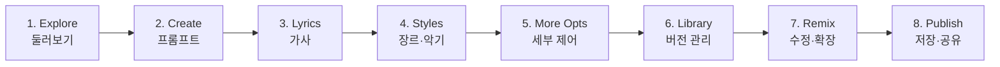

# AI를 활용한 나만의 음악 및 음원 작곡하기

## 2026-04-27 · 월요 AI 3회차 · @카페한디

<div class="mt-10 opacity-80 text-lg">

원리 · 인터페이스 · 무료 크레딧 안에서 한 곡 만들기

</div>

<audio src="/audio/speed-of-light-curiosity.mp3" autoplay loop controls style="position: fixed; bottom: 28px; right: 18px; height: 28px; opacity: 0.55; z-index: 250;"></audio>

<!--
커버. 오늘의 주역은 "음악". 무료로 한 곡 끝까지 만든다는 약속.
배경음악: 광속의_호기심 (Gemini 생성, "AI 학습자를 위한 경쾌한 노래"). 자동재생은 브라우저 정책상 첫 인터랙션 후부터 동작 — 청중 입장 후 슬라이드 키 누르면 시작됨. 컨트롤이 우하단에 작게 떠 있음.
-->

---
layout: section
class: text-center
---

# 🎵 오늘 만들 한 곡, 미리 들어보기

<div class="mt-6 text-base opacity-80">

이 곡 자체가 AI(Gemini Lyria)로 만든 결과물입니다.<br>
"AI 활용을 공부하고 익히는 사람들을 위한 노래" 한 줄 프롬프트.

</div>

<div class="mt-8 flex justify-center">

<video controls src="/audio/speed-of-light-curiosity.mp4" style="max-height: 60vh; border-radius: 8px; box-shadow: 0 4px 24px rgba(0,0,0,0.25);"></video>

</div>

<!--
오프닝 직후. "오늘 마지막에 여러분도 이런 곡을 한 곡 손에 쥐고 갑니다"라는 약속을 결과물로 먼저 보여줌.
mp4는 앨범커버+오디오로 Gemini가 만든 형식.
-->

---

# 오늘의 흐름

| 파트 | 내용 | 시간 |
|---|---|---|
| **오프닝** | 오늘의 약속, 만들 결과물 미리보기 | 10분 |
| **AI 음악 생성 원리** | 텍스트·이미지와의 차이, 기술 계보 | 20분 |
| **Gemini로 맛보기** | Lyria 3, 30초 샘플 체험 | 10분 |
| **Suno 본 실습 흐름** | 8단계 인터페이스 + 시연 | 40분 |
| **각자 만들어보기** | 무료 크레딧으로 3개 Lab | 30분 |
| **공유·정리** | 들어보기, Takeaway 3가지 | 10분 |

<div class="mt-4 opacity-80 text-sm">

오늘 끝날 때 — 각자 **자기 이름으로 태어난 한 곡**을 가지고 돌아간다

</div>

<!--
2시간 타임박스 안내. "한 곡 갖고 가기"가 오늘의 약속.
-->

---
layout: section
---

# AI 음악 생성 이해하기

## 시간 위에서 소리를 이어 붙이는 일

---

# 텍스트 · 이미지 · 음악 — 무엇이 다른가

<div grid="~ cols-3 gap-4" class="mt-8 text-sm">

<div class="p-4 border rounded border-slate-300">

### 텍스트
**다음 단어**를 예측

선형적·논리적

한 줄을 1초 만에 판단

*ChatGPT, Gemini, Claude*

</div>

<div class="p-4 border rounded border-slate-300">

### 이미지
**노이즈 제거** 또는 **다음 토큰**

한순간에 인상 전달

1초 안에 좋고 나쁨

*Midjourney, Nano Banana*

</div>

<div class="p-4 border-2 rounded border-blue-400 bg-blue-50">

### 음악
**시간축 위의 진행**

펼쳐지며 반복되고 변주

**1분 30초가 지나야** 판단

*Suno, Lyria, Udio*

</div>

</div>

<div class="mt-6 opacity-80 text-sm">

음악은 "예쁜 한 장"이 아니라 **인트로 → 벌스 → 후렴 → 브리지 → 아웃트로**의 구조를 만들어야 한다

</div>

<!--
음악 생성의 본질적 차이는 "시간"이다. 이걸 잡지 못한 모델은 "AI 같다"는 말이 나온다.
-->

---

# 소리가 데이터가 된다 — 음악의 디지털화

<div grid="~ cols-2 gap-8" class="mt-6 text-sm">

<div>

**소리 = 공기의 떨림**

손뼉을 치면 공기가 진동 → 고막 흔들림<br>
이 진동을 그래프로 그리면 **파형(waveform)**

**디지털화 = 1초에 몇 번이나 측정하나**

- **샘플링** — CD는 1초에 **44,100번** 측정
- **양자화** — 각 측정값의 세밀도 (16비트=65,536단계)

→ 3분 곡 ≈ **1,500만 개 숫자**

</div>

<div>


</div>

</div>

<div class="mt-4 p-3 rounded bg-blue-50 text-sm">

💡 **숫자라면 AI가 다룰 수 있다** — 늘이고, 줄이고, 패턴 찾고, 새로 만들기. AI 음악 생성은 결국 "이 숫자들 다음에 어울릴 숫자"를 예측하는 일.

</div>

<!--
어렵지 않게 — 음악 파일이 결국 숫자라는 것만 잡아주면 충분.
1500만 개 숫자라는 구체적 수치가 인상에 남는다.
-->

---

# STT · TTS — AI는 이미 소리를 다뤄왔다

<div class="mt-4 text-sm">

| 영역 | 입력 | 출력 | 우리가 이미 쓰고 있는 것 |
|---|---|---|---|
| **STT** (Speech-to-Text) | 음성 파형 | 글자 | 유튜브 자동자막 · Siri · 카톡 음성 → 텍스트 · Whisper |
| **TTS** (Text-to-Speech) | 글자 | 음성 파형 | 내비 안내음성 · AI 더빙 · 오디오북 · ElevenLabs |
| **음악 생성** | 텍스트 프롬프트 | **음악 파형** | **Suno · Lyria · Udio** ← 오늘 |

</div>

<div class="mt-6 grid grid-cols-3 gap-4 text-sm">

<div class="p-3 rounded bg-slate-50 border border-slate-200">

**STT — 듣기**

음성 → "ㅏ", "k" 등 음운<br>
→ 단어·문장으로 조합

</div>

<div class="p-3 rounded bg-slate-50 border border-slate-200">

**TTS — 말하기**

글자 → 음운 →<br>
**파형을 합성**

</div>

<div class="p-3 rounded bg-blue-50 border border-blue-300">

**음악 — 노래·연주하기**

프롬프트 → 음악 패턴 →<br>
**악기·보컬·구조** 생성

</div>

</div>

<div class="mt-4 opacity-80 text-sm text-center">

같은 "소리를 데이터로 다룬다"는 토대 위. **음악 생성은 그 다음 자연스러운 단계.**

</div>

<!--
청중이 이미 매일 STT/TTS를 쓰고 있다는 점을 일깨운다.
"새삼스러운 기술이 아니다"는 안도감 + "다음 단계로 음악"이라는 자연스러움.
-->

---

# AI는 어떻게 음악을 "만드나" — 사람과 비교

<div grid="~ cols-2 gap-8" class="mt-4 text-sm">

<div class="p-4 rounded bg-amber-50 border border-amber-300">

### 👤 사람 작곡가

1. **영감** — "봄에 어울리는 잔잔한 곡"
2. **구조** — 인트로·벌스·후렴·브리지
3. **멜로디** — 도-미-솔-라
4. **화성** — C-Am-F-G
5. **악기·편곡**
6. **가사**
7. **녹음·믹싱**

→ "수많은 곡을 들어본 **경험**"에서 다음 음을 직관으로 결정

</div>

<div class="p-4 rounded bg-blue-50 border border-blue-300">

### 🤖 AI 작곡가

1. **프롬프트** — "Korean ballad, female vocal"
2. **학습 패턴 검색** (수백만 곡)
3. **첫 소리 조각** 생성
4. **다음 0.1초** 예측 → 이어 붙이기
5. **반복** (한 곡 = 수만 조각)
6. **파형 디코딩**
7. **출력**

→ "수백만 곡을 학습한 **확률**"로 다음 소리 결정

</div>

</div>

<div class="mt-4 p-3 rounded bg-yellow-50 border border-yellow-300 text-sm">

💡 **AI는 "익숙한 음악을 빨리"** 만든다. **"새로운 음악을 발명"** 은 여전히 사람의 영역.<br>
오늘의 관점 — AI를 **내 작곡 보조원**으로. 영감과 의도는 내가, 빠른 변환은 AI가.

</div>

<!--
청중에게 "AI가 사람을 대체한다"는 두려움 대신 "보조 도구로 쓴다"는 관점 심기.
사람의 영감·정서가 여전히 핵심이라는 메시지.
-->

---

# AI 음악 생성기가 받는 7가지

<div grid="~ cols-2 gap-8" class="mt-6 text-sm">

<div>

**음악적 요소**

- **장르** — 팝, 재즈, 로파이, EDM, 국악…
- **분위기** — 밝은, 잔잔한, 우울한, 꿈결…
- **템포(BPM)** — 느린 60 / 중간 100 / 빠른 140
- **악기 편성** — 피아노 솔로, 풀 밴드, 신스, 오케스트라

</div>

<div>

**보컬·구조 요소**

- **보컬** — 있음/없음, 남/녀, 톤, 언어
- **가사** — 주제, 행 수, 각운, 언어
- **곡 구조** — 인트로·벌스·후렴·브리지의 순서

</div>

</div>

<div class="mt-6 p-3 rounded bg-yellow-50 border border-yellow-300 text-sm">

💡 **너무 많이 넣지 말 것** — 7개를 다 넣으면 모델이 충돌하는 지시 사이에서 평균값을 낸다.<br>
**장르 + 분위기 + 악기 + 보컬** 네 축만 명확히 해도 충분히 좋은 결과.

</div>

<!--
7개를 다 넣으면 충돌. 4축(장르·분위기·악기·보컬)이 안전한 출발점.
-->

---

# 기술 계보 — Suno와 Lyria 뒤의 연구

<div class="flex justify-center mt-2">


</div>

<div class="mt-2 grid grid-cols-3 gap-4 text-xs">

<div>

**언어 모델 계열**<br>
오디오를 **토큰**으로 쪼개<br>
"다음 토큰" 예측<br>
*AudioLM · MusicLM · Lyria*

</div>

<div>

**Diffusion 계열**<br>
멜 스펙트로그램 위에서<br>
**노이즈 제거** 역학습<br>
*Stable Audio*

</div>

<div>

**자기회귀 + 코드북**<br>
단일 Transformer로<br>
오디오 토큰 자기회귀<br>
*MusicGen · Suno · Udio*

</div>

</div>

<!--
이미지의 GAN/Diffusion/AR 세 계보처럼 음악도 세 계보. Suno와 Lyria는 이 위에 서 있다.
-->

---
layout: statement
---

좋은 프롬프트는 **주제 · 장르 · 분위기 · 악기 · 보컬**

"신나는 노래" ❌ → "밝은 80년대 신스팝, 여성 보컬, 봄날 드라이브" ✅

<!--
이 한 줄이 오늘 프롬프트의 전부. 다음 시간 동안 이 다섯 축을 다양하게 조합해본다.
-->

---
layout: section
---

# Gemini로 맛보기

## 익숙한 인터페이스에서 시작 — 10분

---

# 왜 Gemini 먼저인가

<div grid="~ cols-2 gap-8" class="mt-8">

<div>

**3가지 이유**

1. **익숙한 곳에서 시작** — 평소에 써본 Gemini 인터페이스.
2. **Suno로 넘어가는 다리** — 30초 샘플의 한계가 본 실습의 필요를 만든다.
3. **실패 비용이 0** — 마음 편히 여러 번 눌러볼 수 있다.

</div>

<div>

**티어별 가능 길이**

| 모델 | 곡 길이 |
|---|---|
| Fast | **30초** (오늘 사용) |
| Thinking | 풀 트랙 |
| Pro | 풀 트랙 |

무료 사용자는 Fast 기준 → 30초 샘플만

</div>

</div>

<!--
Gemini는 진입장벽 낮추기용. 본 실습은 Suno라는 점을 분명히 한다.
-->

---
layout: image-right
image: /images/3.2-gemini-create-music.png
backgroundSize: contain
---

# Gemini Lyria 3 진입

**경로**

```
gemini.google.com
  ↓
입력창 옆 Tools (도구)
  ↓
Create music (음악 만들기)
```

<div class="mt-4 text-sm opacity-80">

티어 선택은 자동.<br>
무료 사용자는 **Fast 모델**로 30초.

</div>

<!--
강의 당일 Gemini UI 변경 가능성 — 발표 전에 다시 한 번 확인.
-->

---

# 짧은 프롬프트 3개로 30초씩

<div class="grid grid-cols-1 gap-3 mt-4 text-sm">

<div class="p-3 rounded bg-slate-100 border-l-4 border-blue-500">

**프롬프트 1 — 잔잔한 피아노**

```
잔잔한 피아노 중심의 봄 산책 배경음악, 따뜻한 분위기
```

</div>

<div class="p-3 rounded bg-slate-100 border-l-4 border-blue-500">

**프롬프트 2 — 카페 로파이**

```
카페 분위기의 로파이 힙합, 비 오는 날, 보컬 없음
```

</div>

<div class="p-3 rounded bg-slate-100 border-l-4 border-blue-500">

**프롬프트 3 — 어쿠스틱 인트로**

```
따뜻한 어쿠스틱 기타 인트로, 햇살 가득한 주말 아침
```

</div>

</div>

<div class="mt-4 p-2 rounded bg-yellow-50 border border-yellow-300 text-xs">

💡 같은 프롬프트를 두 번 눌러도 다른 결과가 나온다 — AI 음악의 첫 번째 놀라움

</div>

<!--
3개를 쭉 들려주며 "같은 프롬프트 다른 결과" 체감. 가능하면 강사 미리 생성한 샘플 재생.
-->

---

# Gemini Lyria 결과 — 같은 인터페이스, 다양한 결과

<div class="grid grid-cols-3 gap-3 mt-4 text-xs">

<div class="p-2 rounded bg-slate-50 border border-slate-200">

**🎹 잔잔한 피아노**

<audio controls src="/audio/3.3-gemini-spring-walk.mp3" style="width: 100%; height: 28px;"></audio>

<div class="mt-1 opacity-70">

"봄 산책 배경음악" · 30s

</div>

</div>

<div class="p-2 rounded bg-slate-50 border border-slate-200">

**☕ 카페 로파이**

<video controls src="/audio/table-by-the-window.mp4" style="width: 100%; max-height: 140px;"></video>

<div class="mt-1 opacity-70">

"카페 로파이, 비 오는 날" · mp4

</div>

</div>

<div class="p-2 rounded bg-slate-50 border border-slate-200">

**🌅 어쿠스틱 모닝**

<video controls src="/audio/nine-am-window-seat.mp4" style="width: 100%; max-height: 140px;"></video>

<div class="mt-1 opacity-70">

"햇살 가득한 주말 아침" · mp4

</div>

</div>

</div>

<div class="mt-4 text-sm opacity-80 text-center">

Gemini는 결과를 mp4(앨범 커버 + 오디오)로 묶어 내려준다 — 영상 콘텐츠로 바로 활용 가능

</div>

<div class="mt-3 text-sm opacity-80 text-center">

들으면서 — "더 길게? 가사 넣을 수 있을까? 수정하려면?" 같은 질문이 떠오른다면 **Suno**로 넘어갈 시간

</div>

<!--
실제 audio 파일은 강사가 강의 당일 Suno/Gemini로 생성해 public/audio/에 채워넣음.
-->

---

# Gemini의 한계 → Suno로

<div grid="~ cols-2 gap-8" class="mt-8">

<div>

**Gemini Lyria 3 (무료)**

- ⏱️ 30초만
- 🎤 보컬 약함
- ✏️ 수정 제한적
- 🎯 "샘플" 수준

</div>

<div>

**Suno V4.5 (무료)**

- ⏱️ **최대 8분**
- 🎤 **보컬 강함** (한국어 OK)
- ✏️ Extend · Remix · Cover
- 🎯 **"한 곡" 완성**

</div>

</div>

<div class="mt-8 text-center text-lg font-semibold opacity-80">

→ 본 실습은 Suno에서

</div>

<!--
이 슬라이드 이후 Suno 화면 켜기. 자연스러운 전환.
-->

---
layout: section
---

# Suno로 본 실습

## 무료 크레딧 50으로 한 곡 끝까지 — 40분

---

# Suno 무료 크레딧과 V4.5

<div grid="~ cols-2 gap-8" class="mt-6 text-sm">

<div>

**무료 티어**

- **하루 50 크레딧** 자동 갱신
- 1곡 생성 ≈ **10 크레딧**
- 5곡 정도 가능 (수정 포함하면 적음)
- 미사용 크레딧은 **이월되지 않음**

</div>

<div>

**V4.5는 무료 전용 주력 모델**

- V5/V5.5는 유료 플랜만
- V4.5는 **무료에서 쓸 수 있는 최상위**
- 품질도 "한 곡"에 충분
- 인터페이스는 V5와 거의 동일

</div>

</div>

<div class="mt-6 p-3 rounded bg-yellow-50 border border-yellow-300 text-sm">

⚠️ **상업 이용 주의** — 무료 계정 곡은 개인·비영리 용도로만. 유튜브 수익화·판매는 유료 플랜 필요.

</div>

<!--
크레딧 개념을 청중이 한번에 이해해야 실습이 매끄럽다.
-->

---

# Suno 사용 8단계 흐름

<div class="mt-6 text-sm">



</div>

<div class="mt-6 grid grid-cols-2 gap-4 text-sm">

<div>

**전반부** — 한 곡 만들기

1-5단계로 첫 곡 생성

</div>

<div>

**후반부** — 한 곡 다듬기

6-8단계로 버전 비교·수정·공유

</div>

</div>

<!--
이 8단계는 외울 필요 없다. "Create로 시작 → Library로 모임 → Remix로 다듬기" 흐름만 잡으면 됨.
-->

---
layout: image-right
image: /images/4.3-suno-explore.png
backgroundSize: contain
---

# 1. Explore — 남이 만든 곡 보기

**5분 정도 둘러보기**가 큰 도움

- 어떤 프롬프트가 어떤 결과로?
- 곡 상세 페이지에 **사용된 프롬프트 공개**된 경우 많음
- 장르 필터 — K-pop, Lofi, Korean Folk

<div class="mt-4 p-2 rounded bg-blue-50 text-xs">

💡 **따라하기 전략** — 마음에 드는 Explore 곡의 프롬프트를 복사해 단어 한두 개만 바꿔본다

</div>

<!--
"내 오리지널" 강박 없이 시작. 모방에서 감각이 빨리 는다.
-->

---
layout: image-right
image: /images/4.4-suno-create-simple.png
backgroundSize: contain
---

# 2. Create — Simple 모드

**처음 한두 곡은 Simple로**

프롬프트 한 줄:

```
밝은 1980년대 신스팝, 여성 보컬,
봄날 드라이브 느낌
```

이 한 줄로 **2곡 생성** (10 크레딧).<br>
방향이 잡히면 **Custom 모드**로 이동.

<!--
처음부터 Custom 들어가면 압도된다. Simple → Custom 단계적 진행.
-->

---
layout: image-right
image: /images/4.4-suno-create-advanced.png
backgroundSize: contain
---

# 2-1. Create — Custom (Advanced) 모드

**Simple → Custom 으로 전환**

세 입력란이 펼쳐진다:

- **Lyrics** — 가사 (또는 `[instrumental]`)
- **Styles** — 장르·분위기·악기 (영어)
- **Title** — 곡 제목

<div class="mt-4 p-2 rounded bg-yellow-50 text-xs">

💡 Simple 모드의 결과가 마음에 드는 방향이면 그 프롬프트를 **Styles에 복사**하고 가사·구조를 추가하는 식으로 발전시킨다

</div>

<!--
Custom 모드 화면 구조 안내. Lyrics·Styles·Title 세 박스가 핵심.
-->

---
layout: image-right
image: /images/4.5-suno-lyrics.png
backgroundSize: contain
---

# 3. Lyrics — 가사

**3가지 선택지**

- **없이** → `[instrumental]` 또는 빈칸
- **AI에 맡기기** → 한국어는 들쭉날쭉
- **직접 쓰기** → **2-4줄로 충분**

```
오늘도 천천히 걸어가네
따뜻한 바람이 불어오네
작은 마음 하나 꺼내 보면
봄빛처럼 번져가네
```

AI가 반복·변주해서 곡을 채운다.

<!--
가사가 짧아도 괜찮다는 점 강조. 후렴은 1-2줄로 압축.
-->

---
layout: image-right
image: /images/4.5-suno-lyrics-2.png
backgroundSize: contain
---

# 3-1. Lyrics — 메타 태그 추가

**같은 가사도 구조가 명시되면 결과가 달라진다**

가사 사이에 `[verse]` `[chorus]` `[bridge]` 같은<br>
**대괄호 메타 태그**를 끼워 넣는다.

이 한 줄짜리 변화가 후렴을 더 도드라지게 만든다.

→ 다음 슬라이드에서 자세히

<!--
구조 명시의 효과를 슬라이드 한 장으로 미리 알려준다. 다음 슬라이드의 풀 예시로 자연스럽게 연결.
-->

---

# 메타 태그로 곡 구조 지정

<div grid="~ cols-2 gap-8" class="mt-4 text-sm">

<div>

**Suno가 이해하는 태그**

- `[intro]` — 도입
- `[verse]` — 벌스
- `[pre-chorus]` — 후렴 직전
- `[chorus]` — 후렴
- `[bridge]` — 변화 구간
- `[solo]` — 악기 솔로
- `[instrumental break]`
- `[outro]` `[end]`
- `[whispered]` `[shouted]`

</div>

<div>

```
[verse]
오늘도 천천히 걸어가네
따뜻한 바람이 불어오네

[chorus]
봄빛처럼 번져가네
너의 웃음처럼 번져가네

[bridge]
그 순간 나는 알았지
이 봄이 오래 남을 거라는 걸
```

→ 후렴이 **더 크게, 더 반복적으로**

</div>

</div>

<!--
메타 태그는 Suno의 가장 강력한 도구. 한국어 가사 + 영어 메타 태그 조합이 안정적.
-->

---
layout: image-right
image: /images/4.6-suno-styles.png
backgroundSize: contain
---

# 4. Styles — 장르·악기·보컬

**프롬프트의 "얼굴"**

```
80s synthpop, female vocal, dreamy,
cruising at sunset, synth pads,
drum machine, warm analog texture
```

⚠️ **한국어 vs 영어**<br>
가사는 한국어 OK, **스타일은 영어**가 가장 잘 통한다

<!--
이 한 줄이 곡의 분위기를 결정. 영어 키워드 안내 중요.
-->

---

# 5. More Options — 세부 제어

<div grid="~ cols-2 gap-8" class="mt-6 text-sm">

<div>

**자주 쓰는 옵션**

- **Instrumental** 토글 — 보컬 완전 제거
- **Persona** — 보컬 스타일 저장·재사용
- **Weirdness (낯섦)** 0~100 — 높을수록 예상 밖
- **Style Influence** — 스타일 강도
- **Exclude Styles** — 제외할 스타일

</div>

<div>

**처음에는 기본값**

- 한 번에 하나씩만 건드리기
- 여러 설정 동시에 바꾸면<br>
  무엇이 작용했는지 모름
- 방향 잡히면 그때 미세조정

</div>

</div>

<div class="mt-6 p-3 rounded bg-yellow-50 border border-yellow-300 text-sm">

💡 **Persona의 힘** — 같은 보컬로 시리즈 곡을 만들 수 있다. 가족 행사용 노래를 여러 버전 만들 때 유용.

</div>

<!--
처음엔 압도되지 않게 핵심만. Persona 하나만 기억해도 충분.
-->

---
layout: image-right
image: /images/4.8-suno-library.png
backgroundSize: contain
---

# 6. Library — 버전 쌓는 공간

**한 번에 마음에 드는 곡 = 드물다**

각 곡에서 가능한 동작:

- ▶️ 재생 · ⬇️ 다운로드 (mp3/wav)
- **Extend** — 더 길게
- **Remix** — 스타일 변경
- **Cover** — 가사 유지, 장르 전환
- Workspace에 묶기

3-4번째 시도에서 방향이 보이기 시작

<!--
"한 번에 안 되는 게 정상" 안심시키기. Library는 실패가 쌓이는 공간이 아니라 "버전이 쌓이는 공간".
-->

---
layout: compare
before: /images/4.9-suno-original.png
after: /images/4.9-suno-remix.png
beforeLabel: Original
afterLabel: After Remix
---

# 7. Remix · Extend · Cover

**한 아이디어 → 서너 개 버전**

- **Extend** — 30초 → 3분 풀 버전
- **Remix** — 같은 가사를 재즈로
- **Cover** — 같은 가사를 국악 퓨전으로
- **Edit Lyrics** — 일부 구간만 재생성 (일부 플랜)

가족 앨범·이벤트·브이로그에 골라 쓸 수 있다

<!--
Before/After 이미지는 Library 화면에서 원본 곡과 Remix 결과 두 카드를 캡처.
-->

---

# 7-1. Cover 데모 — 같은 곡, 다른 분위기로

<div grid="~ cols-2 gap-6" class="mt-4 text-sm">

<div class="p-3 rounded bg-amber-50 border border-amber-300">

**원본 — 젖은 오후**

<audio controls src="/audio/wet-afternoon.mp3" style="width: 100%;"></audio>

<div class="mt-1 text-xs">

명상적 드림 팝 발라드<br>
"너무 빨리 어른이 되어가는 것"

</div>

</div>

<div class="p-3 rounded bg-blue-50 border border-blue-300">

**Cover/Mashup — 젖은 오후 × Apricot Hammer**

<audio controls src="/audio/wet-afternoon-x-apricot-hammer-mashup.mp3" style="width: 100%;"></audio>

<div class="mt-1 text-xs">

원본의 가사·분위기 + Apricot Hammer의<br>
warm piano instrumental 결합

</div>

</div>

</div>

<div class="mt-4 p-3 rounded bg-yellow-50 border border-yellow-300 text-sm">

💡 **두 곡을 합쳐 새 곡 만들기** — Suno에 audio 참조를 두 개 올리거나 Cover 기능을 연쇄로. 시리즈 작업의 응용.

</div>

<!--
실제 두 곡을 들려주며 Cover/Mashup의 효과 체감.
-->

---

# 8. Publish · Share · Download

<div grid="~ cols-3 gap-4" class="mt-8">

<div class="p-4 border rounded border-slate-300 text-sm">

### 📥 Download
mp3 / wav

내 기기 저장.<br>
영상 편집·발표·BGM에 활용

</div>

<div class="p-4 border rounded border-slate-300 text-sm">

### 🔗 Share Link
공개 링크 URL

특정 곡 페이지<br>
지인에게 전송

</div>

<div class="p-4 border rounded border-slate-300 text-sm">

### 🌐 Publish
Explore에 공개

다른 사용자가 발견<br>
선택 사항

</div>

</div>

<div class="mt-6 p-3 rounded bg-red-50 border border-red-300 text-sm">

⚠️ **상업 이용 주의** — 무료 곡은 유튜브 수익화·판매·광고 금지. 그 용도라면 **유료 플랜에서 재생성**이 가장 깔끔.

</div>

<!--
오늘 만든 곡을 어디까지 쓸 수 있는지 분명히 안내. 이 부분 모르고 유튜브에 올렸다 문제 되는 사례.
-->

---
layout: section
---

# Suno 프롬프트 레시피

## 5가지 패턴 + 한국어 요령

---
layout: statement
---

**주제 · 장르 · 분위기 · 악기 · 보컬**

이 다섯 축 중 핵심 네 개

가사는 짧게 · 스타일은 영어 · 구조는 메타 태그

<!--
오늘 가져갈 한 줄. 청중이 이것만 메모해도 충분.
-->

---

# 레시피 1 — Instrumental 배경음악

<div grid="~ cols-2 gap-8" class="mt-4 text-sm">

<div>

```
Styles: warm piano instrumental,
spring walk, gentle and bright,
background music

[instrumental]
```

**용도**: 공부·집중·산책·카페 BGM·영상 배경

핵심 키워드: `warm`, `gentle and bright`, `instrumental`

</div>

<div class="p-4 rounded bg-slate-50 border border-slate-200">

🎵 **샘플 — Apricot Hammer**

<audio controls src="/audio/apricot-hammer.mp3" style="width: 100%;"></audio>

<div class="mt-2 text-xs opacity-70">

Suno V4.5 · warm piano instrumental

</div>

</div>

</div>

<!--
가사 없이 만들기. instrumental 태그 + spring walk 같은 분위기 키워드.
"Apricot Hammer"는 Suno가 자동으로 붙인 곡 제목.
-->

---

# 레시피 1-1 — 비 오는 날 Lofi 변형

<div class="grid grid-cols-2 gap-8 mt-4 text-sm">

<div>

같은 instrumental 카테고리에서 분위기를 바꾸면:

```
Styles: lofi hip-hop, chill, rainy day,
piano, soft drums, no vocals,
warm analog texture
Tempo: 80 BPM

[instrumental]
```

`warm` → `chill`, `bright` → `rainy` 만 바뀌어도<br>
완전히 다른 분위기.

</div>

<div class="p-3 rounded bg-blue-50 text-xs">

💡 **하나의 카테고리에서 여러 변형** — instrumental BGM만 해도 분위기에 따라 수십 가지 변주 가능

같은 곡에서 출발해 [[Cover]]로 장르를 바꾸는 것이 가장 빠른 방법

</div>

</div>

<!--
Lofi rainy 자리. 음원은 굳이 없어도 됨 — 패턴만 보여줌. 강의 중 즉석 시도 가능.
-->

---

# 레시피 2 — 한국어 K-Pop 발라드

<div grid="~ cols-2 gap-8" class="mt-4 text-sm">

<div>

```
Styles: Korean K-Pop, acoustic, gentle and bright,
spring walk, warm, calm vocal, slow-tempo

[verse]
오늘도 천천히 걸어가네
따뜻한 바람이 불어오네

[chorus]
봄빛처럼 번져가네
너의 웃음처럼 번져가네
```

**용도**: 가족 행사·기념 영상·일상 콘텐츠

</div>

<div class="p-4 rounded bg-slate-50 border border-slate-200">

🎵 **샘플 — 봄빛처럼 번져**

<audio controls src="/audio/spring-light-spreads.mp3" style="width: 100%;"></audio>

<div class="mt-2 text-xs opacity-70">

Suno V4.5 · 한국어 보컬 · 따뜻한 톤

</div>

</div>

</div>

<!--
한글 가사 + 영어 스타일 조합. 받침 단순한 단어 선택으로 발음이 자연스럽게.
"봄빛처럼 번져"는 Suno가 가사 첫줄에서 자동 추출한 제목.
-->

---

# 레시피 3 — 80년대 신스팝

<div class="text-sm mt-4">

```
Styles: 80s synthpop, female vocal, uplifting,
drum machine, synth brass, cruising at sunset, bright production

[verse]
We're just driving down the line
Nothing but sunshine in our minds

[chorus]
This is the day we never lose
This is the song we never choose to end
```

</div>

<div class="grid grid-cols-2 gap-8 mt-6 text-sm">

<div>

**용도**

- 유튜브 오프닝
- 이벤트 BGM
- 프로모션 영상

</div>

<div>

**핵심 키워드**

- `80s production` — 시대 톤
- `drum machine` — 드럼 머신
- `synth brass` — 신스 관악

</div>

</div>

<!--
영어 가사 예시. 영어가 필요한 콘텐츠일 때 이 패턴.
-->

---

# 레시피 4 — 국악 퓨전

<div class="text-sm mt-4">

```
Styles: Korean traditional fusion, gayageum, daegeum,
haegeum, soft modern beat, female vocal (Korean), cinematic

[verse]
봄바람 자락에 실려 오는 소리
마음이 먼저 기울어지네

[chorus]
오래된 길 위에 피어나는 오늘
우리의 시간이 여기 있네
```

</div>

<div class="mt-6 p-3 rounded bg-blue-50 text-sm">

**용도**: 문화 콘텐츠·공공기관 영상·한국 소개·관광 PR

특정 악기명을 영어로 명시 — `gayageum`, `daegeum`, `haegeum`, `geomungo` 등이 인식된다

</div>

<!--
국악 키워드를 영어로 명확히. 단순히 "Korean traditional"보다 악기명 명시가 결과 좋음.
-->

---

# 레시피 5 — 인디 어쿠스틱

<div grid="~ cols-2 gap-8" class="mt-4 text-sm">

<div>

```
Styles: warm acoustic guitar intro,
sunny weekend morning, intimate recording,
minimal drums

[verse]
창가에 앉아 커피를 내리네
오늘 하루가 시작되는 소리
```

**용도**: 일상 브이로그·개인 작업물

키워드: `intimate recording` · `warm vocal` · `minimal drums`

</div>

<div class="p-4 rounded bg-slate-50 border border-slate-200">

🎵 **샘플 — 토요일의 고요함**

<audio controls src="/audio/saturday-stillness.mp3" style="width: 100%;"></audio>

<div class="mt-2 text-xs opacity-70">

Suno V4.5 · warm acoustic, weekend morning

</div>

</div>

</div>

<!--
잔잔한 인디 톤. "내 일상에 어울리는 음악"의 기본 패턴.
"토요일의 고요함" — Suno 자동 추출 제목.
-->

---

# 보너스 1 — 같은 목소리, 다른 분위기 (Persona)

<div grid="~ cols-2 gap-8" class="mt-4 text-sm">

<div class="p-4 rounded bg-amber-50 border border-amber-300">

**원본 — 토요일의 고요함**

<audio controls src="/audio/saturday-stillness.mp3" style="width: 100%;"></audio>

<div class="mt-2 text-xs">

따뜻한 어쿠스틱, 햇살 가득한 주말 아침

</div>

</div>

<div class="p-4 rounded bg-blue-50 border border-blue-300">

**같은 보컬, 다른 곡 — 도시의 심장**

<audio controls src="/audio/city-heart.mp3" style="width: 100%;"></audio>

<div class="mt-2 text-xs">

같은 목소리에 다른 가사,<br>
**90년대 한국 댄스** 분위기, 템포 빠르게

</div>

</div>

</div>

<div class="mt-4 p-3 rounded bg-yellow-50 border border-yellow-300 text-sm">

💡 **Persona** — 좋은 보컬이 나오면 저장해두고 새 곡에 재사용. 시리즈·가족 행사 곡에 통일감을 만든다.

</div>

<!--
Persona의 효과를 두 곡 비교로 직접 체감. "보컬 한 명을 나만의 가수로 키우기"라는 컨셉.
-->

---

# 보너스 2 — 더 다양한 결과들

<div class="grid grid-cols-2 gap-6 mt-4 text-sm">

<div class="p-3 rounded bg-slate-50 border border-slate-200">

**👶 어린이 자장가 (Kids pop lullaby)**

<audio controls src="/audio/patpat-waiting.mp3" style="width: 100%;"></audio>

<div class="mt-1 text-xs opacity-70">

72 BPM, soft acoustic guitar, glockenspiel,<br>
hand claps, childlike vocal

</div>

</div>

<div class="p-3 rounded bg-slate-50 border border-slate-200">

**🌫️ 명상적 드림 팝 (Ambient dream pop)**

<audio controls src="/audio/wet-afternoon.mp3" style="width: 100%;"></audio>

<div class="mt-1 text-xs opacity-70">

floating synth, distant guitar,<br>
breathy vocal, melancholy but comforting

</div>

</div>

</div>

<div class="mt-4 text-sm opacity-80 text-center">

장르를 다양화하면 — 가족·일상·감성·이벤트 모든 자리에 어울리는 한 곡이 나온다

</div>

<!--
앞에서 다루지 못한 장르들. "프롬프트 한 줄로 이런 분위기까지 가능하다"는 폭 보여주기.
-->

---

# 한국어 가사를 잘 쓰는 5가지 요령

<div grid="~ cols-2 gap-8" class="mt-4 text-sm">

<div>

1. **짧게** — 한 줄 10자 이내가 자연스럽다
2. **쉬운 단어** — 한자어보다 고유어<br>
   "성찰하는" → "돌아보는"
3. **반복** — 후렴은 1-2줄로 압축

</div>

<div>

4. **외래어 주의** — "라떼"·"디지털"은 영어 발음 위험.<br>
   중요 단어는 한글로만
5. **받침** — 받침 복잡한 단어는 발음이 깨짐.<br>
   순서 조정 또는 단어 교체

</div>

</div>

<div class="mt-6 p-3 rounded bg-yellow-50 border border-yellow-300 text-sm">

💡 **테스트 트릭** — 가사 4줄을 큰 소리로 직접 읽어보고 어색한 부분을 수정한 뒤 Suno에 넣는다

</div>

<!--
한국어 발음의 미묘함을 청중과 함께 체감. 직접 읽어보기는 강의 중 즉석 활동 가능.
-->

---

# 프롬프트 실패 → 복구 체크리스트

| 증상 | 점검 포인트 |
|---|---|
| 장르가 엉뚱함 | Styles에 장르 키워드 **영어로** |
| 보컬이 부자연스러움 | 가사를 짧게, **받침 단순화** |
| 곡이 너무 평범 | `80s production` 같은 **제작 힌트** 추가 |
| 후렴이 약함 | `[chorus]` 태그 + 가사 1-2줄로 압축 |
| 너무 시끄러움 | `soft`, `minimal`, `gentle` 추가 |
| 같은 구간 반복 | **Weirdness 슬라이더** 올리기 |

<div class="mt-6 opacity-80 text-sm">

생성된 곡이 마음에 안 들 때 — 이 표를 점검표로

</div>

<!--
구체적 증상별 처방전. 청중이 메모할 만한 슬라이드.
-->

---
layout: section
---

# 각자 만들어보기

## 무료 크레딧 30 안에서 — 30분

---

# 오늘의 실습 3개

<div class="mt-4 text-sm">

| Lab | 내용 | 시간 | 크레딧 |
|---|---|---|---|
| **1. 가사 없이 배경음악** | 장르·분위기·악기만으로 | 10분 | 10 |
| **2. 짧은 가사 넣기** | 2-4줄 가사로 한 곡 | 10분 | 10 |
| **3. 수정하기** | Extend·Remix·Cover 중 하나 | 10분 | 10-20 |

</div>

<div class="mt-6 p-4 rounded bg-blue-50 text-sm">

**전체 플로우 체험이 목표** — 완벽한 곡이 아니라 "Create → Library → Remix"를 한 번씩 거쳐 보는 것

</div>

<div class="mt-4 grid grid-cols-2 gap-4 text-sm">

<div>

**선택 Lab (시간 남으면)**

- 4. Instrumental + 메타 태그
- 5. Personas로 일관된 보컬

</div>

<div>

**집에서 할 일**

- 6. 내 일상에 쓸 음악 1개<br>
  (가게 BGM, 가족 이벤트 등)

</div>

</div>

<!--
labs.md에 자세한 가이드. 강의 중에는 청중이 직접 시도하며 강사는 순회.
-->

---

# 결과 비교 · 공유 팁

<div grid="~ cols-2 gap-8" class="mt-6 text-sm">

<div>

**들어볼 때 체크 포인트**

- 첫 5초의 임팩트 — 인트로가 끄는가?
- 후렴이 도드라지는가?
- 가사 발음이 자연스러운가?
- 끝나는 느낌이 깔끔한가?

</div>

<div>

**다음에 시도할 것**

- 같은 가사 → 다른 장르 (Cover)
- 후렴 가사만 바꾸기
- 같은 프롬프트 두 번 → 비교
- Persona 만들어 보컬 통일

</div>

</div>

<div class="mt-6 p-3 rounded bg-yellow-50 border border-yellow-300 text-sm">

💡 **공유 팁** — 가족·친구 1명에게 보내기. 그 사람의 첫 반응이 다음 수업보다 더 크게 남는다.

</div>

<!--
오늘 만든 곡 1개씩 들어보기. 강사는 짧게 코멘트.
-->

---

# 주의사항 — 짧게 3가지

<div class="grid grid-cols-3 gap-4 mt-6 text-sm">

<div class="p-4 rounded bg-red-50 border border-red-300">

### 1. 저작권

무료 곡 = **개인·비영리만**

유튜브 수익화·판매·광고 → 유료 플랜 필요

특정 가수 모방 프롬프트 ❌

</div>

<div class="p-4 rounded bg-orange-50 border border-orange-300">

### 2. 가짜 앱

Suno = **suno.com만**

"무료 크랙" 검색 결과는 대부분 피싱

모바일은 공식 iOS/Android 앱만

</div>

<div class="p-4 rounded bg-blue-50 border border-blue-300">

### 3. 워터마킹

**SynthID** — Lyria 비가청 워터마크

**C2PA** — 오디오까지 확장 중

외부 공개 시 "AI 생성" 명시 권장

</div>

</div>

<!--
3가지 모두 짧게. 자세한 건 lecture.md 7부 참조.
-->

---
layout: statement
---

오늘의 핵심 3가지

**1. AI 음악은 "대신 작곡"이 아니라 "빨리 시작"** · 결과는 반복·비교에서

**2. 프롬프트 4요소 — 주제·장르·분위기·악기** · 가사는 짧게, 스타일은 영어

**3. 무료 크레딧만으로 한 곡 완성 가능** · 집에서 그대로 반복

<!--
청중이 이 세 줄만 가지고 가도 오늘 수업은 성공.
-->

---

# 우리의 새로운 청사진

<div class="mt-4 text-sm opacity-80 text-center">

오늘 익힌 도구로 만들어볼 수 있는 한 곡 더 — Gemini Lyria 결과

</div>

<div class="mt-6 flex justify-center">

<video controls src="/audio/our-new-blueprint.mp4" style="max-height: 55vh; border-radius: 8px; box-shadow: 0 4px 24px rgba(0,0,0,0.25);"></video>

</div>

<div class="mt-3 text-sm opacity-70 text-center">

영감·차분 — 다음 한 주 동안 만들어볼 곡의 출발점이 되길.

</div>

<!--
정리 직전의 한 곡 더. "이런 곡도 가능하다"는 인상을 마지막에 한 번 더.
-->

---
layout: end
---

# 수고하셨습니다

오늘 만든 곡 한 줄로 — **"오디오를 키워"**

<audio controls src="/audio/turn-up-the-audio.mp3" style="margin-top: 1.5em; opacity: 0.85;"></audio>

<div class="mt-6 text-sm opacity-70">

집에 가실 때 한 번 더 들어보세요. 오늘 우리가 한 일이 이 한 곡 안에 들어 있습니다.

</div>

<!--
"오디오를 키워" — Suno로 만든 메타적 곡, AI 음악 생성을 공부하는 사람들 이야기.
강사가 직접 재생 버튼을 눌러 시작 (자동재생 X — cover BGM과 겹치지 않도록).
한 audio 재생 시 다른 audio는 자동 정지 (global-bottom.vue 동기화).
-->

---
layout: cover
class: text-center
---

# 다음 강의

5/4(월) 14:00 · 같은 장소

**AI로 텍스트에서 영상까지 한 번에 제작하기** 🎬

<!--
다음 강의 예고는 별도 cover 슬라이드로. 독립된 모듈을 유지하면서도 흐름을 이어둠.
-->
